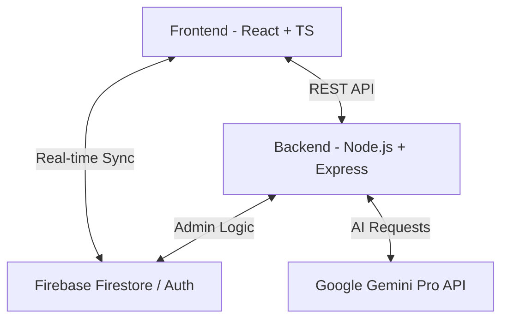

# 🚀 StartupOps - AI-Powered Startup Management Platform

[](https://reactjs.org/)
[](https://www.typescriptlang.org/)
[](https://nodejs.org/)
[](https://firebase.google.com/)

A modern, AI-powered platform designed for startup founders and teams to automate roadmap creation, manage tasks in real-time, and track project metrics with a premium, high-end user experience.

---

## 📺 WATCH DEMO VIDEO HERE 🎥
🎬 **StartupOps - Full Project Walkthrough & Demo**  
🔗 **Google Drive Link:** [View Demo](https://drive.google.com/drive/folders/1-VDqbi1mQ9GNS_rUbqkKLuulUFbSBoU6)

---

## 🎯 Overview
StartupOps is a comprehensive acceleration platform that streamlines startup operations. By leveraging the **Google Gemini AI API**, it automates the transition from ideation to execution, providing founders with personalized roadmaps and actionable tasks in seconds.

### Why StartupOps?
*   ✅ **AI-Driven Strategy** - Dynamic roadmap and task generation based on your unique startup context.
*   ✅ **Premium Glassmorphism UI** - A high-end, responsive dashboard built with **Framer Motion** and **TailwindCSS**.
*   ✅ **Real-Time Collaboration** - Powered by **Firebase Firestore**, ensuring all task updates are synchronized instantly.
*   ✅ **Actionable Insights** - Advanced analytics and investor-hub scoring to track your startup's readiness.

---

## ✨ Features

### 🤖 AI-Powered Tools
*   **Smart Roadmap Generation**: Automatically creates a 12-week execution plan based on your startup industry and stage.
*   **AI Task Expansion**: Give a simple prompt (e.g., "Build a landing page") and Gemini generates a detailed set of sub-tasks, requirements, and methods.
*   **Investor Readiness Scoring**: Analyze your progress and get a real-time score for your pitch and project maturity.

### ✅ Task Management (Kanban)
*   **Dynamic Kanban Board**: Drag-and-drop style task management (To Do, In Progress, Review, Done).
*   **Editable Task Details**: Update assignees, due dates, and requirements on the fly.
*   **Real-time Updates**: Status changes are instantly reflected for all team members.

### 📊 Advanced Analytics
*   **Metric Visualization**: Track your "Done" percentage, total tasks, and milestone progress.
*   **Milestone Sidebar**: Quick overview of your 12-week roadmap with percentage-based progress tracking.

### 🔒 Secure Authentication
*   **Firebase Auth**: Secure login and signup with personalized startup onboarding.
*   **Role-Based Access**: Specialized dashboards for Founders and Team Members.

---

## 🏗️ Architecture



---

## 🛠️ Tech Stack

### Frontend
*   **Framework**: React 18
*   **Language**: TypeScript
*   **Styling**: TailwindCSS + Vanilla CSS
*   **Animations**: Framer Motion
*   **Icons**: Lucide React
*   **Database Client**: Firebase SDK

### Backend
*   **Runtime**: Node.js
*   **Framework**: Express.js
*   **Language**: TypeScript
*   **AI Integration**: Google Gemini API (@google/genai)
*   **Admin SDK**: Firebase Admin

---

## 🚀 Quick Start

### 1️⃣ Clone the Repository
```bash
git clone https://github.com/AarushBhagat/StartupOps.git
cd StartupOps
```

### 2️⃣ Backend Setup
1.  Navigate to the Backend directory:
    ```bash
    cd Backend
    npm install
    ```
2.  Create a `.env` file and add your credentials:
    ```env
    PORT=8080
    GEMINI_API_KEY=your_google_gemini_api_key
    ```
3.  Add your `firebaseServiceAccount.json` to the `src/config/` directory.
4.  Start the server:
    ```bash
    npm run dev
    ```

### 3️⃣ Frontend Setup
1.  Navigate to the Frontend directory:
    ```bash
    cd Frontend
    npm install
    ```
2.  Create a `.env` file with your Firebase config:
    ```env
    VITE_FIREBASE_API_KEY=your_key
    VITE_FIREBASE_AUTH_DOMAIN=your_domain
    # ... other firebase vars
    ```
3.  Start the development server:
    ```bash
    npm run dev
    ```

---

## 🤝 Contributing
1.  Fork the repository
2.  Create a feature branch (`git checkout -b feature/NewFeature`)
3.  Commit your changes (`git commit -m 'Add NewFeature'`)
4.  Push to the branch (`git push origin feature/NewFeature`)
5.  Open a Pull Request

---

## 📄 License
This project is licensed under the MIT License.

## 👥 Authors
*   **Developer**: [Aarush Bhagat](https://github.com/AarushBhagat)

Built with ❤️ by the StartupOps Team
