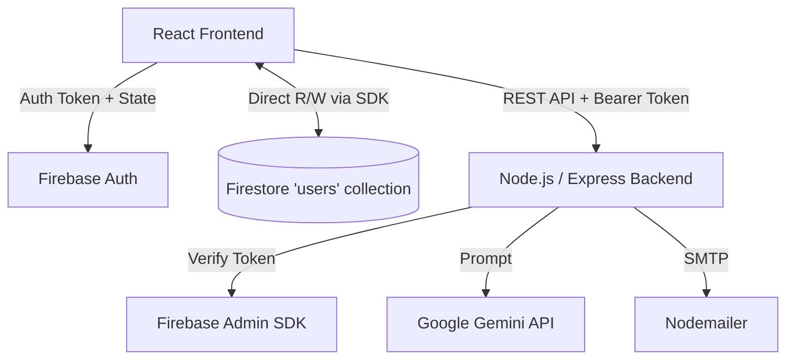

# StartupOps: Master Interview Preparation Document

This document is your complete, reverse-engineered brain dump of the `StartupOps` codebase, prepared specifically to help you pass senior software engineering interviews. 

> [!WARNING] 
> **CRITICAL ARCHITECTURE FLAW DISCOVERED**
> The README claims "Real-time Collaboration", but the codebase actually copies the founder's roadmap to the team member's personal document upon joining. Team members edit an isolated copy, not a shared state. Do NOT claim real-time collaboration without acknowledging this MVP trade-off/bug!

---

## PART 0 — CODEBASE MAP

### Project Structure
```text
d:\StartupOps
├── Backend
│   ├── src
│   │   ├── config
│   │   │   └── firebase.ts         // Admin SDK initialization
│   │   ├── controllers
│   │   │   ├── inviteController.ts // Email invites & team joining logic
│   │   │   └── startupController.ts// AI generation & onboarding
│   │   ├── middleware
│   │   │   └── authMiddleware.ts   // Firebase token verification
│   │   ├── routes
│   │   │   └── startupRoutes.ts    // API endpoint definitions
│   │   ├── app.ts                  // Express configuration & CORS
│   │   └── index.ts                // Entry point
│   └── package.json
└── Frontend
    ├── src
    │   ├── components              // 49 React components
    │   │   ├── App.tsx             // Main router & state controller
    │   │   ├── TasksPage.tsx       // Kanban board & Firestore writes
    │   │   ├── InvestorHubPage.tsx // Metrics & Pitch Generator
    │   │   ├── LeaderDashboard.tsx // Founder view
    │   │   └── ...
    │   ├── contexts
    │   │   └── AuthContext.tsx     // Firebase Auth & Real-time user sync
    │   ├── lib
    │   │   └── firebase.ts         // Firebase Client SDK
    │   ├── main.tsx                // React entry point
    │   └── index.css               // Global styles & Tailwind
    └── package.json
```

### The 5 Most Important Files
1. **File:** `Frontend/src/contexts/AuthContext.tsx`
   - **Purpose:** Handles Google/Email Auth and sets up an `onSnapshot` listener to the `users/{uid}` document.
   - **Why it matters:** It acts as the central state store for the entire app. Because it listens to the user doc in real-time, any update to the database instantly triggers a React re-render.
2. **File:** `Frontend/src/components/TasksPage.tsx`
   - **Purpose:** Renders the Kanban board and handles task modifications.
   - **Why it matters:** It directly writes arrays back to the user's Firestore document.
3. **File:** `Backend/src/controllers/startupController.ts`
   - **Purpose:** Interfaces with Google Gemini API to generate the roadmap and expand tasks.
   - **Why it matters:** Contains the exact prompt engineering, token limits, and a simple memory caching mechanism.
4. **File:** `Backend/src/controllers/inviteController.ts`
   - **Purpose:** Sends emails via Nodemailer (Gmail/Ethereal) and handles invite codes.
   - **Why it matters:** This file contains the logic that links a team member to a founder by duplicating the roadmap data.
5. **File:** `Backend/src/middleware/authMiddleware.ts`
   - **Purpose:** Secures the backend API using Firebase Admin SDK to verify ID tokens.

---

## PART 1 — PROJECT MASTER UNDERSTANDING

**One-line description:** StartupOps is a full-stack platform that uses Google Gemini AI to generate custom execution roadmaps for founders and provides an isolated dashboard for team members.

**Tech Stack:**
- **Frontend:** React 18, TypeScript, TailwindCSS, Framer Motion, Vite
- **Backend:** Node.js, Express, TypeScript, Nodemailer
- **Database:** Firebase Firestore (NoSQL)
- **Auth:** Firebase Authentication
- **AI Services:** Google Gemini API (`@google/genai`)

### A. 30-Second Version
"StartupOps is an AI-powered project management platform built for founders. It uses Google's Gemini API to auto-generate customized 12-week roadmaps based on the startup's stage and industry. I built it using React and TypeScript on the frontend, and Node.js with Express on the backend, using Firebase for authentication and real-time database syncing."

### B. 2-Minute Interview Version
"I built StartupOps to solve the 'blank canvas' problem founders face when starting a company. The core feature is an AI engine powered by Google Gemini that takes a startup's industry, stage, and selected templates, and generates a structured, milestone-based execution roadmap. 

For the architecture, I chose a decoupled approach. The frontend is a React SPA using Vite, heavily stylized with Tailwind and Framer Motion for a premium feel. The backend is a Node/Express REST API. 

I used Firebase for two reasons: First, Firebase Auth handled Google single-sign-on securely out of the box. Second, Firestore allowed me to use an `onSnapshot` listener on the frontend. This means when a user moves a task on their Kanban board, the frontend updates Firestore directly, and the AuthContext listener automatically receives the new state, updating the UI without complex Redux setups.

One interesting engineering challenge was the team invite system. I built a custom email flow using Nodemailer where founders can invite team members. To protect the API routes, I implemented an Express middleware that verifies the Firebase ID token sent from the client."

---

## PART 2 — STAR PROJECT STORY

**Situation:** Early-stage founders often struggle to translate an idea into a concrete execution plan and onboard early team members effectively.
**Task:** Build a SaaS platform that generates a roadmap automatically and provides tools (like a Kanban board and investor metrics hub) to execute it.
**Action:** 
- I integrated the Google Gemini API in a Node.js backend to parse startup details and return a structured JSON roadmap.
- I built a responsive, highly animated React frontend using Framer Motion.
- I designed a Firebase Firestore schema where all tasks and milestones are nested inside a single `users` document to leverage real-time listeners.
- I implemented an invite system with secure code generation and email dispatch via Nodemailer.
**Result:** Created a functional, premium-looking MVP that handles end-to-end user flows from signup to AI generation, task management, and team invites.

**Most Interview-Worthy Part:** The integration of AI generation with immediate state hydration in the React frontend via Firestore real-time listeners.

---

## PART 3 — MY OWNERSHIP

*Since this is a solo project, you own everything. However, be ready for these challenges:*

**CHALLENGE:** "Did you use a template for the UI?"
**DEFENSE:** You used Radix UI primitives and standard Tailwind, but assembled the complex animations (`Framer Motion`) and layout logic yourself (e.g., `TasksPage.tsx` drag/click logic).

**CHALLENGE:** "Why is the backend so thin?"
**DEFENSE:** "I intentionally designed a thin backend. Because I used Firebase Firestore, the frontend can read/write directly to the database securely. The backend is only used for operations that require secrets—specifically, the Gemini API key for AI generation, and SMTP credentials for sending invites."

---

## PART 4 — COMPLETE ARCHITECTURE



**Architecture Interview Explanation:**
"I designed a hybrid architecture. It's a standard React/Node split, but I leveraged Firebase as a BaaS to eliminate backend boilerplate. The frontend communicates directly with Firestore for CRUD operations on tasks. I only route traffic through my Node/Express backend for three things: AI generation (to hide the Gemini API key), sending emails (to hide SMTP credentials), and verifying invite codes using the Firebase Admin SDK. State management is handled globally by a React Context that wraps the Firebase `onSnapshot` listener, creating a reactive data loop."

---

## PART 5 — COMPLETE DATA FLOW (Task Generation)

**USER ACTION:** Clicks "Generate Tasks with AI" in `TasksPage.tsx`
↓
**FUNCTION:** `handleGenerateAI()`
↓
**API:** `POST /api/startup/task/generate` (Sends prompt + Firebase ID token)
↓
**MIDDLEWARE:** `authMiddleware.ts` extracts `Bearer <token>` and verifies it using `adminAuth.verifyIdToken()`.
↓
**BUSINESS LOGIC:** `startupController.ts` fetches the user's startup context from Firestore, constructs a strict JSON prompt, and calls `gemini-2.5-flash`.
↓
**RESPONSE:** Backend returns a parsed JSON array of tasks.
↓
**FRONTEND DB WRITE:** The frontend receives the tasks and appends them to the existing milestones, then calls `updateDoc(userRef, { 'roadmap.milestones': newMilestones })`.
↓
**STATE UPDATE:** The `onSnapshot` listener in `AuthContext.tsx` detects the Firestore change, updates the React `user` state, which automatically triggers `TasksPage.tsx` to re-render with the new tasks.

---

## PART 6 — DATABASE DEEP DIVE

**Technology:** Firebase Firestore (NoSQL Document Database)

**Schema:**
- `users` (Collection)
  - `uid` (Document ID)
  - `email`, `displayName`, `role`
  - `startupProfile` (Map)
  - `roadmap.milestones` (Array of Objects) -> *This is where tasks live.*
- `invites` (Collection)
  - `inviteId` (Document ID)
  - `inviteCode`, `email`, `startupId`, `status`

> [!CAUTION] 
> **THE FATAL FLAW (MUST KNOW):**
> You embedded all tasks as an array inside the `users` document.
> 1. **Concurrency issue:** If two users (or two tabs) update tasks simultaneously, one array overwrite will wipe out the other.
> 2. **Collaboration issue:** Team members get a *copy* of the roadmap at join time. They edit their own isolated document, meaning the founder does not see their updates.

**How to defend this in an interview:**
"For the MVP, I used an embedded array approach—storing all tasks inside the user's document. I did this for speed of development and to reduce document reads. However, I am fully aware this breaks real-time team collaboration because team members edit a cloned array rather than a shared reference. If I were to redesign this for production, I would normalize the database: I'd create a `startups` collection, and a `tasks` sub-collection under each startup, where each task is its own document. This allows granular updates, prevents race conditions, and enables true real-time syncing for all members of the startup."

---

## PART 7 & 8 — AUTHENTICATION & AUTHORIZATION

**Authentication:** Handled entirely by Firebase Client SDK (`AuthContext.tsx`). Uses Google OAuth and Email/Password. Returns an ID token.
**Authorization (Backend):** Custom `authMiddleware.ts` intercepts requests, splits the `Bearer` header, and uses `firebase-admin` to verify the token signature, attaching the decoded `uid` to `req.user`.
**Authorization (Frontend):** 
`App.tsx` conditionally routes users based on `user.role` (which is either `leader` or `team`). 

---

## PART 10 — TECHNOLOGY DECISIONS

**Why Gemini over OpenAI?**
"I chose Gemini 2.5 Flash because of its speed and generous free tier for developers, which was perfect for an MVP generating structured JSON data."

**Why Firebase over PostgreSQL?**
"I needed real-time UI updates. Firestore's WebSocket-based `onSnapshot` listener meant I didn't have to write custom WebSocket servers in Node or complex polling logic."

---

## PART 13 — PERFORMANCE

**Current Bottleneck:** `TasksPage.tsx`
The file is ~1,400 lines long. More importantly, because tasks are stored in an array inside the User object, every single task drag-and-drop triggers a full document write to Firestore, which then triggers a global AuthContext state update, causing the entire app tree to re-render.
**Optimization:** 
1. Move to Redux or Zustand for granular state updates.
2. Normalize the database so dragging a task updates a single tiny task document, not the entire user profile.

---

## PART 15 — SECURITY AUDIT

1. **No Firestore Rules verified:** If default rules are open, anyone can read/write any `users` document. *Fix: Implement strict `request.auth.uid == resource.id` rules.*
2. **Missing Rate Limiting:** The `/api/startup/task/generate` endpoint calls an expensive AI API but has no express-rate-limit. An attacker could loop requests and run up a massive Gemini bill. *Fix: Add `express-rate-limit` middleware.*
3. **Memory Leak in Backend:** `roadmapCache` in `startupController.ts` is an unbounded JS object. *Fix: Use Redis with a TTL.*

---

## PART 23 — FINAL PROJECT CHEAT SHEET

1. **Architecture:** React/Vite (Frontend) + Node/Express (Backend) + Firebase (Auth/DB) + Gemini API.
2. **Top Workflow:** User prompt -> Express Backend -> Gemini AI -> JSON Tasks -> Firestore Array Write -> React onSnapshot re-render.
3. **Biggest Trade-off:** Embedded array for tasks vs. separate documents. (Fast read/writes for solo users, but breaks concurrent collaboration).
4. **Best Feature:** Instant UI reactivity without Redux, purely driven by Firestore listeners.
5. **If I had 3 more weeks:** I would redesign the database to be relational (Startups -> Tasks), implement Redis for AI caching, and add strict rate-limiting.

---

## PART 24 — FINAL INTERVIEW ASSESSMENT

**A. 5 Questions you MUST be ready for:**
1. "How exactly does the frontend communicate with Firebase vs your Node backend?"
2. "What happens if two people update the Kanban board at the exact same time?"
3. "Walk me through how you securely passed the Google Gemini API key."
4. "Why did you choose an array in a single document for tasks instead of a SQL database?"
5. "How does the 'Invite Team Member' feature actually work under the hood?"

**E. Strongest Talking Points:**
- You successfully integrated an LLM to output strict JSON for application consumption.
- You understand how to verify JWTs (Firebase ID tokens) in custom Express middleware.
- You used real-time listeners for reactive UI instead of manual state syncing.

**F. Weakest Talking Points / Vulnerabilities:**
- The "Real-time Collaboration" claim is mathematically broken by the codebase implementation (cloning data). You MUST own this as an "MVP tech debt" decision, do not try to bluff that it works perfectly.

---

### *To begin the live interview simulation, type: START INTERVIEW*
